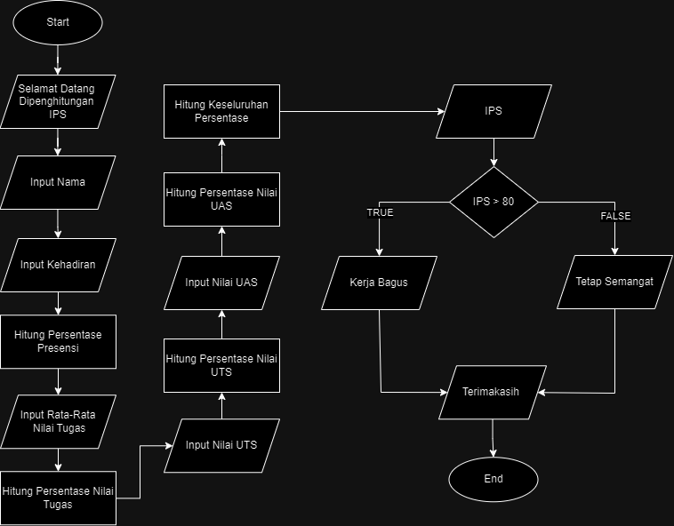

# PROGRAM PENGHITUNGAN IPS(Indeks Prestasi Semester)

## STUDY KASUS (MASALAH)
Program ini bertujuan untuk memudahkan Mahasiswa untuk mengetahui nilai semester dari suatu mata kuliah

## FLOWCHART PROGRAM
